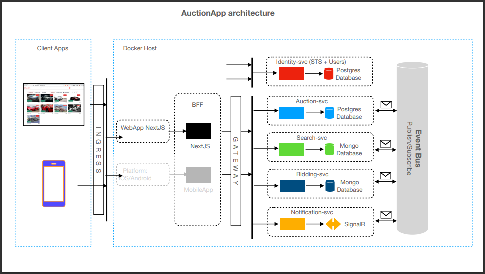

- By default NextJS Component is server component if not using `use client` at the top of file but this isn't for `*.ts` file so if you want to call to server from `.ts` file make sure you had `use server` at top of that `.ts` file